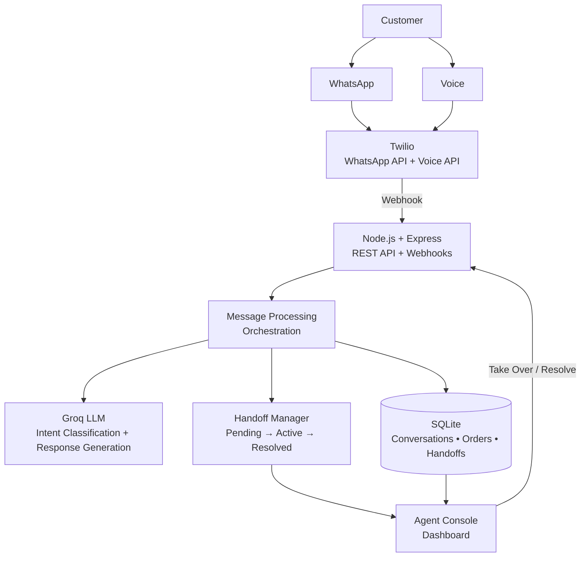

# ContextSwitch

### Context-Aware Multichannel AI Customer Support

ContextSwitch is a multichannel AI support system that allows customers to start a conversation on WhatsApp, continue through voice, and escalate to a human agent — without repeating their context.

Built with **Twilio WhatsApp & Voice, Node.js, Express, Groq, SQLite, and REST APIs**.

> **Core idea:** The conversation follows the customer, not the channel.

## Live Demo

**Agent Console:**  
https://contextswitch-ai.onrender.com/agent.html

> The application is deployed on Render's free tier and may take a few seconds to wake up after inactivity.

## What ContextSwitch Solves

Customer support conversations often become fragmented when customers switch communication channels or move from an AI assistant to a human agent.

ContextSwitch maintains shared conversation and order context across those transitions.

A customer can:

**WhatsApp → Voice → Human Agent**

while the system preserves information such as:

- conversation history
- detected intent
- referenced order
- order status
- payment status
- handoff state

The human agent therefore receives the existing context instead of starting the conversation from zero.
## Demo

### AI-to-Human Handoff

A customer requesting human assistance is automatically added to the agent handoff queue.


### Context-Preserving Escalation

The agent receives the customer's previous messages and relevant order context before taking over the conversation.


### Agent Takeover

Pending handoffs can be taken over by an agent and moved into an active support session.


### Real Twilio WhatsApp Integration

ContextSwitch receives customer messages through Twilio WhatsApp webhooks and returns AI-generated responses using backend-validated order data.


## Key Features

- **Multichannel Support** — Customers can interact through WhatsApp and voice using Twilio.
- **Cross-Channel Context** — Conversation history is preserved when a customer switches between channels.
- **AI Intent Classification** — Groq LLM identifies customer intent and extracts relevant order information.
- **Backend Business Actions** — Supports operations such as order status checks, cancellations, and refund requests.
- **Human Handoff** — Customers can request human assistance, creating a handoff that moves through pending, active, and resolved states.
- **Agent Console** — Support agents can view conversations, inspect customer context, take over conversations, and resolve handoffs.
- **REST APIs** — Backend functionality is exposed through structured REST endpoints.
- **Error Handling** — Handles invalid orders, unsupported operations, and invalid handoff state transitions.
## Tech Stack

### Backend
- Node.js
- Express.js
- REST APIs
- Webhooks

### AI
- Groq API
- `openai/gpt-oss-20b`

### Communication
- Twilio WhatsApp API
- Twilio Voice API
- Speech Recognition

### Database
- SQLite
- better-sqlite3

### Frontend
- HTML
- CSS
- JavaScript

### Development
- Git
- GitHub
- ngrok
## Architecture

ContextSwitch follows a backend-driven architecture where Twilio handles multichannel communication, the Node.js/Express backend orchestrates AI and business logic, and the agent console manages human handoffs.


## Engineering Decisions

### LLMs interpret requests — they don't control application state

ContextSwitch uses the LLM for intent classification and natural-language response generation, while order operations and handoff state transitions remain controlled by deterministic backend logic.

This prevents the model from directly modifying application state or bypassing business rules.

### Shared identity enables cross-channel context

WhatsApp and voice identifiers are normalized into a common customer identity. This allows conversation history and order context to be retrieved even when the customer changes communication channels.

### Human handoff is modeled as a state machine

Handoffs follow a controlled lifecycle:

Pending → Active → Resolved

Invalid state transitions are rejected by the backend.

## How It Works

### 1. Customer Interaction

A customer can start a conversation through WhatsApp or voice.

```text
WhatsApp / Voice
       ↓
     Twilio
       ↓
 ContextSwitch
```

### 2. Customer Identification and Context

The backend identifies the customer and retrieves their previous conversation history from SQLite.

This allows ContextSwitch to preserve context when the customer switches between WhatsApp and voice.

### 3. AI Intent Detection

The customer's message and relevant conversation history are sent to the Groq LLM.

The model identifies the customer's intent and extracts an order ID when applicable.

For example:

```json
{
  "intent": "order_status",
  "orderId": "5912"
}
```

The backend then uses this structured result to determine which business operation should be performed.

### 4. Backend Business Logic

The backend uses the detected intent to execute the appropriate business operation.

For example, it can retrieve an order's status, process a cancellation request, or create a refund request based on the order's current state.

Business rules are handled by the backend rather than the AI model, ensuring that database changes and customer actions follow predefined conditions.

### 5. Response Generation

After the backend completes the requested operation, the result is passed to the response-generation layer.

The Groq LLM converts the structured backend result into a natural customer-facing response.

The AI is only responsible for generating the response. It does not directly modify the database or perform business operations.

### 6. Human Handoff

If the customer requests human assistance, ContextSwitch creates a human handoff.

The handoff moves through three states:

```text
Pending
   ↓
Active
   ↓
Resolved
```

Support agents can view pending handoffs through the Agent Console, take over the conversation, and resolve it after assisting the customer.

### 7. Agent Console

The web-based Agent Console provides support agents with a centralized view of customer conversations.

Agents can:

- View pending human handoffs
- Take over conversations
- View conversation history
- Inspect customer context
- See the communication channel used
- Resolve completed handoffs

This allows the support agent to continue the conversation with the existing context instead of asking the customer to repeat their issue.

### 8. Cross-Channel Context

The same conversation context is maintained regardless of whether the customer interacts through WhatsApp or voice.

For example:

```text
Customer → WhatsApp
"Where is my order 5912?"
             ↓
ContextSwitch identifies order 5912
             ↓
Customer → Voice
"Can you cancel it?"
             ↓
Previous context identifies "it" as order 5912
             ↓
Backend checks cancellation rules
             ↓
Response returned to customer
```

This is the core idea behind ContextSwitch: **customers can change channels without losing the context of their conversation.**
## API Endpoints

### Customer & Conversation APIs

| Method | Endpoint | Description |
|---|---|---|
| `GET` | `/messages` | Retrieve conversation messages |
| `GET` | `/conversations/:conversationId/context` | Retrieve conversation context |
| `POST` | `/process-test` | Process a customer message locally for testing |

### Order APIs

| Method | Endpoint | Description |
|---|---|---|
| `GET` | `/orders/:orderId` | Retrieve order details |
| `POST` | `/orders/:orderId/cancel` | Request cancellation of an eligible order |

### Human Handoff APIs

| Method | Endpoint | Description |
|---|---|---|
| `GET` | `/handoffs` | Retrieve pending handoffs |
| `GET` | `/handoffs/active` | Retrieve active handoffs |
| `POST` | `/handoffs/:id/takeover` | Assign a pending handoff to an agent |
| `POST` | `/handoffs/:id/resolve` | Resolve an active handoff |

### Twilio Webhooks

| Method | Endpoint | Description |
|---|---|---|
| `POST` | `/twilio` | Receive incoming WhatsApp messages from Twilio |
| `POST` | `/voice` | Initiate a voice interaction |
| `POST` | `/voice-process` | Process speech received during a voice interaction |
## Project Structure

```text
contextswitch-ai/
│
├── database/
│   └── db.js
│
├── public/
│   └── agent.html
│
├── services/
│   ├── ai.js
│   └── processMessage.js
│
├── utils/
│   └── helpers.js
│
├── response-generator.js
├── server.js
├── package.json
├── package-lock.json
├── README.md
└── .gitignore
```

### Directory Overview

- **`server.js`** — Express server, REST APIs, and Twilio webhook routes.
- **`services/ai.js`** — AI-powered intent classification and order ID extraction.
- **`services/processMessage.js`** — Main message-processing and orchestration logic.
- **`response-generator.js`** — Generates customer-facing responses using the Groq LLM.
- **`database/db.js`** — SQLite database setup, tables, seed data, and database operations.
- **`utils/helpers.js`** — Shared utility functions such as customer ID normalization.
- **`public/agent.html`** — Web-based support agent console.
## Testing & Edge Cases

ContextSwitch was tested against both normal customer requests and invalid or unsupported scenarios to verify that backend rules are enforced correctly.

### Tested Scenarios

| Scenario | Expected Behavior |
|---|---|
| Valid order status request | Returns the current order status |
| Invalid order ID | Returns an order-not-found response |
| Cancellation of eligible order | Cancellation request succeeds |
| Cancellation of shipped order | Cancellation is rejected |
| Refund for delivered order | Refund request is created |
| Refund for non-delivered order | Refund request is rejected |
| Unknown customer request | System returns a safe fallback response |
| Human handoff request | Creates a pending handoff |
| Pending → Active | Agent can take over the handoff |
| Active → Resolved | Agent can resolve the handoff |
| Invalid handoff transition | Operation is rejected |
| WhatsApp → Voice | Previous conversation context is preserved |

### Business Rule Validation

Business operations are validated by the backend before modifying application state.

For example, an order cancellation is only allowed when the order satisfies the required cancellation conditions. Similarly, refund requests are validated against the order's current status and payment state.

This prevents the AI layer from bypassing application rules or directly modifying database state.
## Example Conversation Flow

A customer can interact with ContextSwitch across multiple channels while maintaining the same conversation context.

### Step 1 — WhatsApp

```text
Customer:
"Where is my order 5912?"

ContextSwitch:
"Your order 5912 has been shipped."
```

### Step 2 — Switch to Voice

The customer switches from WhatsApp to a voice call.

```text
Customer:
"Can you cancel it?"
```

ContextSwitch uses the existing conversation context to understand that **"it"** refers to order `5912`.

The backend then checks whether the order is eligible for cancellation before performing the operation.

### Step 3 — Human Handoff

If the customer requests human assistance:

```text
Customer:
"I want to speak to a human."
```

A handoff is created:

```text
Pending
   ↓
Agent takes over
   ↓
Active
   ↓
Agent resolves
   ↓
Resolved
```

The support agent can view the conversation history and existing customer context through the Agent Console.
## Setup & Installation

### 1. Clone the Repository

```bash
git clone <your-repository-url>
cd contextswitch-ai
```

### 2. Install Dependencies

```bash
npm install
```

### 3. Configure Environment Variables

Create a `.env` file in the project root:

```env
GROQ_API_KEY=your_groq_api_key
```

Do not commit the `.env` file to GitHub.

### 4. Start the Server

```bash
node server.js
```

The server will start on:

```text
http://localhost:3000
```

### 5. Local Testing

The backend provides local testing endpoints that can be used without sending real messages through Twilio.

For example:

```http
POST /process-test
```

with a JSON body:

```json
{
  "conversationId": "test-user",
  "message": "Where is my order 5912?"
}
```

### 6. Twilio Configuration

For WhatsApp and voice functionality, configure the appropriate Twilio webhooks to point to the publicly accessible server URL.

During local development, a tunneling service such as ngrok can be used to expose the local Express server to Twilio.

```text
Twilio
   ↓
Public URL
   ↓
Local Express Server
   ↓
ContextSwitch
```
## Future Improvements

Potential extensions for ContextSwitch include:

- **Persistent customer authentication** for identifying customers across sessions.
- **Additional communication channels** such as web chat or email.
- **Conversation summarization** for faster handoffs between AI and human agents.
- **Agent response support** directly from the Agent Console.
- **Analytics and reporting** for conversation volume, handoff rates, and resolution patterns.
- **Production database deployment** using a managed database instead of local SQLite.
- **Persistent production database** using PostgreSQL or another managed database instead of ephemeral SQLite storage.